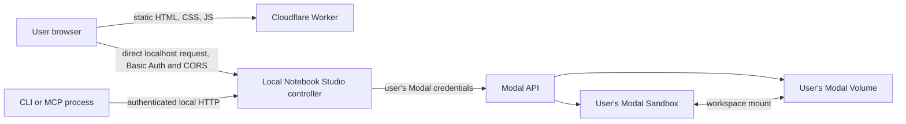

# Modal Notebook Studio

A personal, GPU-enabled JupyterLab workspace controlled from a browser, command line, or AI agent. The shared website is a static Cloudflare Worker; each user runs a small local controller that connects to that user's own Modal account and Volume.

- **Hosted website:** <https://modal-notebook-studio-staging.bhansalimanan55.workers.dev>
- **Download the local helper:** <https://modal-notebook-studio-staging.bhansalimanan55.workers.dev/downloads/notebook-studio-helper.zip>
- **Source:** <https://github.com/seenmttai/modal-notebook-studio>

> The website URL is shareable, but it is not a shared GPU service. Every user must run their own local controller and connect their own Modal credentials. Compute, storage, and billing belong to the Modal workspace selected by that user.

## Contents

- [Features](#features)
- [Architecture and data flow](#architecture-and-data-flow)
- [Quick start](#quick-start)
- [Configuration](#configuration)
- [Browser and data security](#browser-and-data-security)
- [GPU sessions, storage, and budget guard](#gpu-sessions-storage-and-budget-guard)
- [Training a model through MCP](#training-a-model-through-mcp)
- [Command-line reference](#command-line-reference)
- [MCP server reference](#mcp-server-reference)
- [Kernel versions and benchmark runs](#kernel-versions-and-benchmark-runs)
- [Observability and known limits](#observability-and-known-limits)
- [Cloudflare Worker deployment](#cloudflare-worker-deployment)
- [Development and tests](#development-and-tests)
- [Troubleshooting](#troubleshooting)
- [License](#license)

## Features

- JupyterLab sessions on the GPU choices returned by the local controller, with configurable CPU, RAM, maximum runtime, and idle timeout.
- An estimated maximum-cost display and an app-side reservation guard before a session starts.
- A persistent per-Modal-workspace Volume for datasets, notebooks, models, checkpoints, outputs, and caches.
- Dataset upload, listing, download, and deletion in the website, CLI, and MCP.
- Workspace file operations from the CLI and MCP. The website's Storage page currently explains the workspace layout; it is informational rather than a file browser.
- Stable kernel IDs, immutable numbered notebook versions, versioned attachments, a separate benchmark-run history, event/log streaming, structured status, and selective output downloads.
- An AI-oriented CLI that emits JSON by default and an MCP server with tools, resources, and a benchmark-review prompt.
- A public static frontend that does not need D1, R2, a server-side API, or a public tunnel to the user's controller.

## Architecture and data flow



The Worker serves files and `/health`. It does not forward `/api` calls. The browser calls `http://127.0.0.1:8000` directly, so notebook links and user Modal credentials do not pass through Cloudflare. `/api/*` on the public Worker intentionally returns HTTP 410 with instructions to start the local helper.

The local controller authenticates browser, CLI, and MCP requests, maintains the local session and budget ledger, and uses the Modal SDK for Sandbox and Volume operations. A Modal API token is saved against the local login and encrypted in the local SQLite database. A username-derived namespace keeps this app's Modal app and Volume names distinct for different local logins in a shared controller.

## Quick start

### Run from a Git clone

Requirements:

- Python 3.11 or newer.
- A browser that can grant the hosted HTTPS page access to localhost. Recent Chrome and Chromium builds support this flow.
- A Modal account and credentials if you want to launch compute.

```sh
git clone https://github.com/seenmttai/modal-notebook-studio.git
cd modal-notebook-studio
./run.sh
```

The first run creates `.venv`, installs the web app, Modal SDK, MCP SDK, and development test dependencies, and creates a private `.env` if one does not exist. It generates a random local app password and a random credential-encryption key, sets the file mode to `0600`, then starts the controller on `127.0.0.1:8000`.

Open <http://127.0.0.1:8000> for a same-origin local experience. The default local username is `local`; the generated password is the `APP_PASSWORD` value in your private `.env`. Alternatively, open the [hosted website](https://modal-notebook-studio-staging.bhansalimanan55.workers.dev), choose **Connect local helper**, and enter the helper URL, username, and password. Allow the browser's local-network permission prompt for the site.

In the website, open **Account → Connect Modal** and enter your Modal token. The controller verifies it and stores an encrypted copy locally. You can then choose a GPU on Overview and launch a session.

### Run from the helper ZIP

Download the [helper ZIP](https://modal-notebook-studio-staging.bhansalimanan55.workers.dev/downloads/notebook-studio-helper.zip), extract it, and run `./run.sh` from the extracted directory. It contains source and setup files, not `.env`, a database, credentials, or a Python virtual environment. Python 3.11+ and network access for package installation are required.

### Using it with friends

Share the hosted website or this repository. Each friend should use a separate helper directory on their own device, start it with `./run.sh`, and connect a Modal account they control. Do not share `.env`, the SQLite database, or a Modal token. Tokens from the same Modal workspace use that workspace's shared storage and billing allowance; separate Modal accounts keep those separate.

## Configuration

`run.sh` creates `.env` from `.env.example`. Edit `.env` while the controller is stopped, then restart it for changes to take effect.

| Variable | Default | Purpose |
| --- | --- | --- |
| `APP_PASSWORD` | Generated on first run | Password for the local controller. Keep it private. |
| `HOST` | `127.0.0.1` | Bind address. Keep loopback for the hosted-browser workflow; do not bind to `0.0.0.0` to make the Worker work. |
| `PORT` | `8000` | Local controller port. The hosted page defaults to `http://127.0.0.1:8000`. |
| `APP_ALLOWED_ORIGINS` | Staging Worker origin | Comma-separated exact browser origins allowed to call the controller cross-origin. For a different Worker hostname, add its exact HTTPS origin and restart the controller. |
| `MODAL_ENABLED` | `false` | Enables configured single-user Modal access modes. Normally leave false and connect the user's token in Account. |
| `MODAL_APP_NAME` | `personal-notebook-studio` | Base name for the app's Modal Sandbox resources. |
| `MODAL_VOLUME_NAME` | `personal-notebook-studio-workspace` | Base name for the persistent Modal Volume. |
| `MONTHLY_COMPUTE_BUDGET_USD` | `30` | App-side estimated compute allowance for this local controller. |
| `BUDGET_SAFETY_BUFFER_USD` | `1` | Amount reserved from the configured app-side allowance. |
| `MAX_SESSION_HOURS` | `8` | Maximum requested session duration; the app clamps this to 24 hours. |
| `DEFAULT_IDLE_TIMEOUT_MINUTES` | `15` | Default Sandbox idle timeout. |
| `UPLOAD_LIMIT_GIB` | `4` | Maximum size of one dataset upload. |
| `DATABASE_PATH` | `./data/studio.sqlite3` | Local SQLite database path. Keep this file private. |
| `APP_PUBLIC` | `false` | Controls whether login authentication is required. Do not enable for a network-exposed controller without deliberately configuring access. |
| `MULTI_USER_MODE` | `false` | Enables the controller's optional local multi-user mode. A separate local helper per friend is simpler and safer for personal use. |
| `MODAL_CREDENTIAL_ENCRYPTION_KEY` | Generated on first run | Key used to encrypt saved Modal credentials. Back it up securely; losing it prevents decrypting stored credentials. |
| `ADMIN_PROVISIONING_KEY` | Empty | Optional key for the local user-provisioning endpoint. Do not publish it. |

The CLI and MCP client read `APP_PASSWORD` from `.env` and map it to `NOTEBOOK_STUDIO_PASSWORD` in the process. When the CLI/MCP runs outside the project directory, set `NOTEBOOK_STUDIO_URL`, `NOTEBOOK_STUDIO_USERNAME`, and `NOTEBOOK_STUDIO_PASSWORD` explicitly.

## Browser and data security

| Data | Location | Notes |
| --- | --- | --- |
| Static frontend | Cloudflare Worker assets | Public HTML, CSS, and JavaScript only. No API credentials or user database. |
| GPU/resource preferences | Browser `localStorage` | Local to that browser profile; does not sync between devices. |
| Helper URL and username | Browser `localStorage` | Used to reconnect to localhost. The password is cleared from the form after connecting and is not saved there. |
| Safe dashboard snapshot | Browser `localStorage` | Active session links, notebook tokens, and Sandbox IDs are removed before caching. It is a convenience snapshot, not authoritative billing data. |
| App password and encryption key | Local `.env` | Generated locally by `run.sh`. Never commit or send this file. |
| Session history, reservations, dataset metadata | Local SQLite | Kept on the controller machine. Excluded from the helper archive and Git. |
| Modal API credentials | Local SQLite, encrypted | Encryption uses `MODAL_CREDENTIAL_ENCRYPTION_KEY`. The hosted Worker does not receive the token. |
| Dataset and model bytes | User's Modal Volume | Persistent storage is billed and governed by the user's Modal workspace. |
| Notebook run outputs | User's Modal Volume | Listed and downloaded through the local controller. |

The browser talks directly to localhost. For the hosted page, the browser must allow local-network access and the exact Worker origin must be in `APP_ALLOWED_ORIGINS`. CORS and Basic Auth are both required. The controller should remain bound to loopback for this setup.

The MCP `modal_account_connect` tool accepts token values as arguments. MCP clients may retain tool arguments in transcripts or logs. Prefer the website form or the CLI's hidden prompt for token entry; use the MCP token tool only with a host whose handling of sensitive tool arguments you trust.

## GPU sessions, storage, and budget guard

The GPU catalog and prices are returned by the local controller. Use `notebook-studio gpus` or the website's Overview and Usage views to see current choices. A session selects one GPU plus CPU and RAM. The app estimates the maximum session cost, reserves that amount before launch, and asks Modal for a maximum runtime and idle timeout.

This budget guard is an **app-side estimate**, not a Modal-enforced spending cap. It only tracks sessions launched through this controller. It cannot see other Modal apps, exact free-credit balance, Volume storage, later price changes, or all billing adjustments. Modal's dashboard and invoice are authoritative. Check them before and after GPU work.

The app creates a named Modal Volume for the configured account/namespace and mounts it at `/workspace`. Common directories are:

- `/workspace/notebooks`
- `/workspace/datasets`
- `/workspace/models`
- `/workspace/checkpoints`
- `/workspace/outputs`
- `/workspace/caches`
- `/workspace/kernels`

Dataset uploads go under `/workspace/datasets`; uploaded file metadata is kept in the local database. Generic Storage operations are restricted to the approved workspace roots above. A file deletion removes it from the Volume; dataset deletion also removes its dataset record.

A benchmark run executes inside an already-running Sandbox. Its compute time is part of that session's provider usage; it does not create a separate GPU allocation. A benchmark timeout cannot extend the remaining lifetime of the active Sandbox.

## Training a model through MCP

The MCP server can run a notebook-based training workflow without opening the website. It orchestrates the local controller; Modal performs the compute.

1. Ask MCP for `studio_status`, `usage_status`, and `gpu_options` to inspect available resources and app-side budget.
2. Start a session with `session_start`, choosing GPU, CPU, RAM, runtime, and idle timeout.
3. Upload training data using `dataset_upload` or `storage_upload`. The path argument is read by the MCP server process, so the file must exist on the machine running that process.
4. Create a stable project ID with `kernel_create`, then use `kernel_push` with a local `.ipynb` and any attachment paths. A push creates an immutable numbered version.
5. Start it with `kernel_run_start(kernel_id, version, timeout_seconds)`. An active GPU session is required.
6. Inspect `kernel_run_status`, `kernel_run_events`, or `kernel_run_wait`; review the error reason and cell progress.
7. Call `kernel_run_outputs` to list files, then `kernel_output_download` to retrieve selected checkpoints, metrics, or logs.

Notebook versions run from top to bottom using `nbclient`. Put the training loop, checkpoint saving, and evaluation in the notebook. The base Sandbox image includes JupyterLab, PyTorch, Transformers, Datasets, Accelerate, NumPy, Pandas, Matplotlib, scikit-learn, and safetensors. Additional packages can be installed from notebook cells, but a fresh Sandbox may need to install them again.

The MCP interface does not currently provide an arbitrary shell command or interactive cell-by-cell editing tool. To change code, edit the local notebook and push a new immutable version. The website or `session_open` can open JupyterLab for interactive work.

## Command-line reference

`run.sh` installs the `notebook-studio` command into `.venv/bin`. Run it from the project directory so it can read `.env`. JSON is the default output format; add `--format text` for a readable Python-style view.

### Status, GPU choices, estimates, and sessions

```sh
.venv/bin/notebook-studio status
.venv/bin/notebook-studio gpus --format text
.venv/bin/notebook-studio estimate --gpu T4 --cpus 4 --ram 32 --hours 2
.venv/bin/notebook-studio usage

.venv/bin/notebook-studio sessions start --gpu T4 --cpus 4 --ram 32 --hours 2 --idle-minutes 15
.venv/bin/notebook-studio sessions list
.venv/bin/notebook-studio sessions status SESSION_ID
.venv/bin/notebook-studio sessions logs SESSION_ID --follow
.venv/bin/notebook-studio sessions open SESSION_ID
.venv/bin/notebook-studio sessions stop SESSION_ID
```

`estimate` validates the selected GPU, CPU, RAM, and hours against the controller's choices, then caps the estimate by available app-side budget and maximum configured runtime. Status and session-start outputs omit bearer-bearing notebook URLs. `sessions open` uses the link internally and prints only the session ID/status.

### Datasets and workspace files

```sh
.venv/bin/notebook-studio datasets list
.venv/bin/notebook-studio datasets upload ./train.csv
.venv/bin/notebook-studio datasets download DATASET_ID --output ./train.csv
.venv/bin/notebook-studio datasets delete DATASET_ID

.venv/bin/notebook-studio storage list --path /models
.venv/bin/notebook-studio storage upload ./weights.bin --path /models
.venv/bin/notebook-studio storage download /models/weights.bin --output ./weights.bin
.venv/bin/notebook-studio storage delete /models/old-weights.bin
```

### Modal account connection

```sh
.venv/bin/notebook-studio account status
.venv/bin/notebook-studio account connect
.venv/bin/notebook-studio account forget
```

`account connect` prompts for the token ID and token secret; the secret prompt does not echo the value. Forgetting the saved credential does not revoke it at Modal. Revoke a compromised or unwanted token separately in Modal. Forget is blocked while a session is active.

### Stable kernels and benchmark runs

Create a kernel from a notebook, or create an empty stable ID and push later:

```sh
.venv/bin/notebook-studio kernel push ./train.ipynb --name qwen-experiment --attachment ./config.json
.venv/bin/notebook-studio kernel create qwen-experiment
.venv/bin/notebook-studio kernel list
.venv/bin/notebook-studio kernel versions KERNEL_ID
```

Push a new immutable version to an existing ID, then run and inspect it:

```sh
.venv/bin/notebook-studio kernel push ./train.ipynb --kernel-id KERNEL_ID --attachment ./config-v2.json
.venv/bin/notebook-studio kernel benchmark KERNEL_ID --version 2 --timeout 3600 --follow
.venv/bin/notebook-studio kernel runs KERNEL_ID
.venv/bin/notebook-studio kernel status RUN_ID
.venv/bin/notebook-studio kernel logs RUN_ID --follow
.venv/bin/notebook-studio kernel outputs RUN_ID
.venv/bin/notebook-studio kernel download RUN_ID metrics.json --output ./metrics.json
.venv/bin/notebook-studio kernel download-version KERNEL_ID 2 --output ./version-2.zip
```

Use `kernel download RUN_ID` without a path to list artifacts. Specify a relative artifact path and `--output` to download one selected artifact. `--attachment` can be repeated. Attachments under the notebook's directory keep their relative paths inside the version bundle; files outside it are included by filename.

Other useful commands:

```sh
.venv/bin/notebook-studio --help
.venv/bin/notebook-studio kernel --help
.venv/bin/notebook-studio sessions --help
```

For the optional shared-login mode, the CLI also has `users provision USERNAME`; use it only after intentionally configuring multi-user authentication and the admin provisioning key.

## MCP server reference

The MCP server uses stdio and is installed as `.venv/bin/notebook-studio-mcp`. Configure your MCP host to launch that command. Set these environment variables in the MCP host's private settings:

- `NOTEBOOK_STUDIO_URL` — normally `http://127.0.0.1:8000`.
- `NOTEBOOK_STUDIO_USERNAME` — normally `local`.
- `NOTEBOOK_STUDIO_PASSWORD` — the `APP_PASSWORD` from the local `.env`.

Example shape (replace the placeholders in your MCP host configuration; do not commit a populated config):

```json
{
  "mcpServers": {
    "notebook-studio": {
      "command": "/absolute/path/modal-notebook-studio/.venv/bin/notebook-studio-mcp",
      "args": [],
      "env": {
        "NOTEBOOK_STUDIO_URL": "http://127.0.0.1:8000",
        "NOTEBOOK_STUDIO_USERNAME": "local",
        "NOTEBOOK_STUDIO_PASSWORD": "SET_THIS_PRIVATELY"
      }
    }
  }
}
```

### MCP tools

| Area | Tools |
| --- | --- |
| Overview | `studio_status`, `gpu_options`, `usage_status` |
| Notebook sessions | `session_list`, `session_start`, `session_status`, `session_open`, `session_stop`, `session_logs`, `session_events` |
| Datasets | `dataset_list`, `dataset_upload`, `dataset_download`, `dataset_delete` |
| Workspace | `storage_list`, `storage_upload`, `storage_download`, `storage_delete` |
| Account | `studio_account_status`, `modal_account_status`, `modal_account_connect`, `modal_account_forget` |
| Kernels and runs | `kernel_list`, `kernel_create`, `kernel_versions`, `kernel_push`, `kernel_run_start`, `kernel_run_status`, `kernel_run_events`, `kernel_run_history`, `kernel_run_wait`, `kernel_run_outputs`, `kernel_output_download`, `kernel_version_download` |

Resources are `notebook-studio://dashboard`, `notebook-studio://usage`, and `notebook-studio://kernels`. The `benchmark_review` prompt guides an agent through version review, budget checks, run inspection, failure analysis, and artifact review.

`session_events` and `kernel_run_events` collect a bounded event slice and cap a single wait at 60 seconds. Call them again or use the status/wait tools to continue monitoring. `session_open` opens JupyterLab in the MCP host's browser and returns no bearer URL. On a headless or remote MCP host, use the website or CLI on the machine with the browser.

MCP file arguments such as `local_path`, `notebook_path`, and `attachment_paths` refer to files accessible to the MCP server process, not automatically to the AI client machine. For remote MCP hosts, transfer files to that host first or use a local MCP host.

The server exposes explicit delete and credential-forget tools. An AI agent should confirm the intended destructive action with the user before calling them. Token-bearing tool arguments may be retained by an MCP client; prefer the CLI's hidden prompt or the website Account form for Modal token entry.

## Kernel versions and benchmark runs

A **kernel ID** identifies a notebook project; it does not identify a running Jupyter kernel process. Each push creates a numbered, immutable version containing the notebook and attachments. Metadata includes a bundle hash, cell count, and attachment names. Existing versions are not overwritten when new code is pushed.

A **benchmark run** executes one immutable version in the active Sandbox. Run history is associated with the stable kernel ID but stored separately from Jupyter session history. A run captures status, timestamps, exit code/failure reason, cell progress events, log text, associated session/Sandbox, and an output directory on the Volume.

Managed notebook execution uses `nbclient` callbacks to report cell starts, completions, and failures. Output APIs list artifacts and allow selective download; they do not require downloading the entire Volume. A version bundle can also be downloaded to recover the exact notebook and attachment set used for a run.

## Observability and known limits

Structured session and benchmark status can include lifecycle phase, elapsed/runtime caps, requested resources, observed resource snapshots when available, Sandbox ID, current/total notebook cells, exit code, and failure reason. The API does not expose Modal queue position or worker hostname through this Sandbox client. Those values are returned as `null` with explanatory detail rather than guessed.

Live logs and events are available through `sessions logs --follow`, `kernel logs RUN_ID --follow`, MCP `session_events`, MCP `kernel_run_events`, and the local SSE routes. Resource observations depend on metrics available inside the Sandbox (for example, cgroup/proc data and `nvidia-smi`). A missing metric is reported as unavailable, not zero.

Additional limits:

- The budget guard covers only sessions launched through this app and is not a hard account-wide cost limit.
- Benchmark runs require an already-running GPU session and consume its remaining runtime.
- MCP does not expose arbitrary remote shell access or interactive cell-by-cell notebook editing.
- The MCP event tools return bounded slices; they are not an indefinite push stream.
- Modal Volume storage and provider billing are controlled by the connected Modal workspace.
- Local database loss removes this controller's session/account metadata. Back up `.env` and the database securely if you need recovery; never publish them.

## Cloudflare Worker deployment

The public staging site is <https://modal-notebook-studio-staging.bhansalimanan55.workers.dev>. The static source is `notebook_studio/web`; the Worker entry point is `worker/src/index.ts`. `worker/public/` is generated at deploy time and intentionally excluded from Git.

To deploy your own Worker, install Wrangler dependencies and authenticate to Cloudflare:

```sh
cd worker
npm install
npx wrangler login
npm run deploy:staging
```

`deploy:staging` runs asset sync, packages a credential-free helper ZIP, compiles TypeScript, and deploys `wrangler.staging.jsonc`. `npm run deploy` uses `wrangler.jsonc` for the non-staging Worker. The deployed Worker serves static assets and `/health`; it returns HTTP 410 for `/api/*`.

If you use a different Worker hostname, add the exact HTTPS origin to `APP_ALLOWED_ORIGINS` in each local helper's `.env` and restart that helper. The helper must still bind to loopback. Browser local-network permission must be granted for each browser profile/device.

The Worker has no D1 or R2 binding. The helper ZIP builder is `worker/scripts/build_helper.py`; it packages source and documentation while excluding `.env`, SQLite databases, `.dev.vars`, virtual environments, Wrangler caches, and generated Worker assets.

## Development and tests

Install the development dependencies and run the tests:

```sh
python3 -m venv .venv
. .venv/bin/activate
python -m pip install -e '.[dev,modal,mcp]'
python -m pytest -q
```

The automated suite uses temporary databases and mocked Modal providers; it does not launch GPU Sandboxes or require Modal credentials. It covers authentication and origin checks, storage/path validation, immutable kernel versions, benchmark history and outputs, CLI behavior, MCP tools, observability, and token-redaction behavior.

The hosted frontend was also exercised in headless Chromium against the deployed Worker and a temporary local controller. That pass covered all six views, GPU/resource selection, preference persistence, dataset rejection without Modal credentials, helper reconnection, password clearing, and ensuring active-session links/Sandbox IDs do not enter browser storage.

## Troubleshooting

| Symptom | Check |
| --- | --- |
| Browser says it cannot reach the local helper | Start `./run.sh`; use `http://127.0.0.1:8000`; allow the browser's local-network prompt. |
| `401 Authentication required` | Use username `local` and the private `APP_PASSWORD` from `.env`; restart after changing it. |
| Browser gets a CORS error | Add the exact Worker origin, including scheme and hostname, to `APP_ALLOWED_ORIGINS`; restart the helper. |
| Website says the Modal account is disconnected | Open Account and connect a token. A successful local-controller login is separate from Modal account connection. |
| Session start is rejected for budget | Check Usage, reduce GPU/CPU/RAM/runtime, or adjust the app-side estimate limit. Also verify real Modal credits in Modal's dashboard. |
| Dataset upload is rejected | Check that a Modal token is connected, the file is nonempty, and it is below `UPLOAD_LIMIT_GIB`. |
| Notebook or benchmark fails | Inspect structured status, failure reason, `sessions logs` or `kernel logs`, and run events. Verify required Python packages and Volume paths. |
| MCP cannot find an uploaded file | The path is resolved on the machine running the MCP server. Move the file there or run MCP locally. |
| Worker `/api/*` returns 410 | Expected: only the static frontend is on the Worker. Start the local helper and connect the browser to localhost. |

## License

No license file is included. A public GitHub repository is visible to everyone, but public visibility alone does not grant permission to reuse, redistribute, or publish modified copies. Add an explicit license before inviting others to reuse the source.
