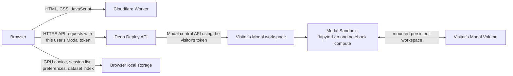

# Modal Notebook Studio

A shareable browser workspace for launching JupyterLab on each user's own Modal account. **Cloudflare Worker serves the website frontend; Deno Deploy is the API intermediary for Modal.** Visitors do not install Python, start a local web server, or provide a shared Modal key.

- **Website:** <https://modal-notebook-studio-staging.bhansalimanan55.workers.dev>
- **Deno API:** <https://modal-notebook-studio.manan.deno.net>
- **Source:** <https://github.com/seenmttai/modal-notebook-studio>
- **Optional local CLI/MCP controller:** `./run.sh` (needed only for the Python CLI/MCP features described below)

Each visitor connects a Modal API token in the browser. The token is stored in that browser's local storage and sent over HTTPS with API requests. The Deno app does not save user tokens, browser history, or uploaded file metadata in a database. Each Modal workspace gets its own named app and persistent Volume namespace.

## What runs where



Cloudflare Worker serves the static frontend. The browser calls Deno Deploy directly for Modal API operations; the Worker does not receive the Modal token. Deno accepts browser API requests only from the configured Worker origins. Neither web service runs notebook code or allocates a GPU.

A notebook session itself **does** require a Modal Sandbox container. Modal runs that Sandbox in the workspace belonging to the connected token and bills its requested GPU, CPU, and RAM there. Starting a session also installs notebook packages inside that Sandbox; setup time uses the selected Modal resources. The site cannot run GPU work without this provider compute.

## Website features

- GPU picker with VRAM, published rate estimates, CPU and RAM selection, maximum runtime, and idle timeout.
- Start and stop JupyterLab sessions through an encrypted Modal tunnel.
- Session status, observed CPU/RAM metrics, Sandbox ID, and setup/Jupyter logs.
- Dataset upload, list, and delete in the user's Modal Volume. Upload requires a running notebook Sandbox because the current Modal JavaScript SDK exposes Volume files through a mounted Sandbox. The hosted upload limit is 32 MiB per file; downloads through the API are limited to 16 MiB.
- Informational Storage page for the Volume workspace layout.
- Browser-local session history, dataset index, GPU preferences, and a monthly cost estimate.

The website's monthly estimate is a **browser-side planning aid**, not a Modal spending cap. It only knows about sessions tracked by that browser; it cannot read the account's free-credit balance or usage from other Modal apps. Its limit can be adjusted on the Usage page. Modal's dashboard and invoice remain authoritative.

The website currently does not expose the stable kernel/version/benchmark-run API through its Deno backend. Those features are available through the existing Python API and its CLI/MCP tools when the optional local controller is running.

## Hosting and expected cost

The frontend uses the existing Cloudflare Worker and its account's request/CPU allowances; the Deno API uses Deno Deploy quotas. These are separate services and usage is subject to each account's current plan and limits. Check [Cloudflare Workers pricing](https://developers.cloudflare.com/workers/platform/pricing/) and [Deno Deploy pricing](https://deno.com/deploy/pricing) for current allowances. Neither service keeps a notebook container running.

Modal use is separate. Connecting a token performs a read-only credential check. Launching a notebook creates a billable Modal Sandbox and a named Volume in the user's Modal workspace. Volume storage may incur charges above the workspace's included allowance. The app does not know how much credit remains and cannot guarantee that a session stays within free credits.

## Browser storage and token handling

| Item | Stored in | Notes |
| --- | --- | --- |
| Modal token ID and secret | This browser's `localStorage` | Plain browser storage, not an encrypted password vault. Any script executing on this site in this browser profile could read it. Use a trusted browser profile and revoke a token in Modal if it is exposed. |
| Session IDs and Jupyter links | This browser's `localStorage` | Jupyter links contain a bearer token; treat the browser profile as sensitive. |
| Preferences, session history, dataset index, estimate limit | This browser's `localStorage` | Does not sync to another browser or device. Clearing site data removes the history and token. |
| Notebook files and datasets | User's Modal Volume | Persists independently of browser storage. |
| Website source and static assets | Cloudflare Worker | Public code/assets only; no Modal tokens or user database. |

The site sends credentials in HTTPS request headers or the one-time connection request body. It does not put a Modal API token in a URL. The API does not write token values to application logs or persistent storage. The Modal token is not shared with other visitors.

Modal resources are named using a hash derived from the token ID so users get separate app/Volume namespaces. If you replace the token with a different token ID, the site derives a different namespace. Copy data in Modal before switching token IDs if you need to preserve the old Volume. Tokens from one Modal workspace still share that workspace's billing and account-level storage allowance.

## Deploying the Deno API

Deno Deploy hosts the Modal API intermediary only; it does not serve the website frontend. The Deno CLI uses the OS keyring. On headless Debian/Termux, scripts/with-deno-keyring.sh provides a D-Bus Secret Service keyring, and the deploy script uses that wrapper. In this environment the keyring has an empty passphrase and is protected by owner-only filesystem permissions, so the saved login persists between CLI processes but is not encrypted at rest.

From the repository root:

```sh
cd worker
deno task check
deno task test
DENO_BIN=/path/to/deno npm run deploy:deno
```

The Deno app is modal-notebook-studio in the manan organization. Its app and organization are recorded in worker/deno.json; update them when deploying your own copy. The deploy script passes that config explicitly and preserves the Deno CLI login through the keyring wrapper. DENO_BIN is optional when deno is already on PATH. For local API development, run `PORT=8765 deno task start` from `worker/`; this starts the API only.

## Deploying the Cloudflare Worker frontend

The staging Worker serves the shareable website at <https://modal-notebook-studio-staging.bhansalimanan55.workers.dev>. Wrangler requires Node.js 22 or newer and a logged-in Cloudflare account.

```sh
cd worker
npm install
npm run deploy:staging
```

deploy:staging copies notebook_studio/web/ into worker/public/, builds the Worker, and deploys wrangler.staging.jsonc. Use npm run deploy for the production Worker configured in wrangler.jsonc. Both configs set DENO_API_ORIGIN; the Worker exposes it through /studio-config.js, and the frontend calls that Deno origin directly. When deploying your own frontend/API pair, update the Worker DENO_API_ORIGIN and add the exact Worker origin to CORS_ALLOWED_ORIGINS in worker/deno/main.ts.

## Deno API routes

The browser calls these routes cross-origin from the allow-listed Cloudflare Worker origin. CORS permits only those configured origins and required headers. Requests that operate on Modal resources include the visitor's token ID and secret in `X-Modal-Token-Id` and `X-Modal-Token-Secret` headers. The API creates a Modal SDK client for the request, closes it afterward, and does not persist credentials.

| Route | Purpose |
| --- | --- |
| `GET /health` | Health check without Modal credentials. |
| `GET /api/dashboard` | GPU catalog, resource choices, upload limit, and local-estimate defaults. |
| `POST /api/modal-credentials` | Verify a token with a read-only Modal SDK call; does not save it. |
| `POST /api/sessions` | Create a GPU Sandbox with JupyterLab and mount the user's Volume. |
| `GET /api/sessions/{id}/status` | Structured lifecycle and resource status. |
| `GET /api/sessions/{id}/logs` and `/events` | Read bounded setup/Jupyter logs and status events. |
| `POST /api/sessions/{id}/stop` | Terminate the Sandbox. |
| `GET/POST /api/datasets` and `DELETE /api/datasets/{id}` | List, upload, and delete files in the mounted Volume; upload requires an active session. |
| `GET /api/storage`, `PUT /api/storage/files`, `GET /api/storage/download`, `DELETE /api/storage/files` | Basic mounted-Volume file operations. |

Workspace paths are restricted to `/workspace/notebooks`, `datasets`, `models`, `checkpoints`, `outputs`, `caches`, and `kernels`. The API limits one upload to 32 MiB and one download to 16 MiB.

## Optional Python CLI and MCP

The repository also contains an AI-oriented CLI and MCP server for stable kernel IDs, immutable notebook versions, benchmark runs, event/status queries, selective output downloads, sessions, and storage operations. Those existing clients call the Python FastAPI controller. They are optional and are **not required for using the hosted website**.

Start that controller only when you want to use those existing CLI/MCP tools:

```sh
./run.sh
```

It runs on the local device, not as a cloud service, and does not host the shared website. The CLI and MCP features are not yet wired to the Deno Deploy API. Do not expose the Python controller publicly; keep it bound to loopback. See the CLI and MCP source/documentation in `notebook_studio/cli.py`, `notebook_studio/mcp_server.py`, and the Python API in `notebook_studio/main.py`.

## Testing

Deno route tests make no Modal API calls that allocate resources:

```sh
cd worker
deno task check
deno task test
node --check ../notebook_studio/web/static/app.js
```

The deployed UI can be smoke-tested in headless Chromium. Tests should use a temporary browser profile and fake tokens for navigation and local-storage checks. Credential verification uses the read-only `getImageBuilderVersion` Modal call. Do not test a launch path unless you intend to create a billable Sandbox in the connected Modal workspace.

Python API, CLI, MCP, and kernel tests run with:

```sh
cd ..
.venv/bin/pytest
```

## Security and operating limits

- Never put a Modal token in source code, a URL, a screenshot, or a public issue. Use Account settings and revoke any exposed token in Modal.
- A browser's `localStorage` is convenient per-device storage, not protection from malicious JavaScript or anyone using that browser profile.
- The Deno app has no shared login or user database. Visitors use their own Modal token; each account pays for its own Modal compute and storage.
- The monthly browser estimate is not a provider-enforced account budget. A user can exceed it through another browser, another Modal app, or direct API requests.
- Modal image packages are installed during the notebook Sandbox startup. That setup consumes the selected session's runtime and resources.
- Volume data persists after a session stops. Forgetting a token from the browser does not delete or revoke Modal resources.
- Modal's JavaScript SDK is in beta. Recheck its release notes when updating it: <https://modal.com/docs/sdk/js/releases>.

## Local controller quick start

The hosted website works without a local server. The Python controller is only needed for the optional CLI and MCP clients. Running `./run.sh` from the repository root creates a Python virtual environment, installs the project dependencies, initializes private local settings, and starts the API on `127.0.0.1:8000`. Keep it bound to loopback.

## Training a model through MCP

The MCP server can run a notebook-based training workflow without opening the website. It orchestrates the local controller; Modal performs the compute.

1. Ask MCP for `studio_status`, `usage_status`, and `gpu_options` to inspect available resources and app-side budget.
2. Start a session with `session_start`, choosing GPU, CPU, RAM, runtime, and idle timeout.
3. Upload training data using `dataset_upload` or `storage_upload`. The path argument is read by the MCP server process, so the file must exist on the machine running that process.
4. Create a stable project ID with `kernel_create`, then use `kernel_push` with a local `.ipynb` and any attachment paths. A push creates an immutable numbered version.
5. Start it with `kernel_run_start(kernel_id, version, timeout_seconds)`. An active GPU session is required.
6. Inspect `kernel_run_status`, `kernel_run_events`, or `kernel_run_wait`; review the error reason and cell progress.
7. Call `kernel_run_outputs` to list files, then `kernel_output_download` to retrieve selected checkpoints, metrics, or logs.

Notebook versions run from top to bottom using `nbclient`. Put the training loop, checkpoint saving, and evaluation in the notebook. The base Sandbox image includes JupyterLab, PyTorch, Transformers, Datasets, Accelerate, NumPy, Pandas, Matplotlib, scikit-learn, and safetensors. Additional packages can be installed from notebook cells, but a fresh Sandbox may need to install them again.

The MCP interface does not currently provide an arbitrary shell command or interactive cell-by-cell editing tool. To change code, edit the local notebook and push a new immutable version. The website or `session_open` can open JupyterLab for interactive work.

## Command-line reference

`run.sh` installs the `notebook-studio` command into `.venv/bin`. Run it from the project directory so it can read `.env`. JSON is the default output format; add `--format text` for a readable Python-style view.

### Status, GPU choices, estimates, and sessions

```sh
.venv/bin/notebook-studio status
.venv/bin/notebook-studio gpus --format text
.venv/bin/notebook-studio estimate --gpu T4 --cpus 4 --ram 32 --hours 2
.venv/bin/notebook-studio usage

.venv/bin/notebook-studio sessions start --gpu T4 --cpus 4 --ram 32 --hours 2 --idle-minutes 15
.venv/bin/notebook-studio sessions list
.venv/bin/notebook-studio sessions status SESSION_ID
.venv/bin/notebook-studio sessions logs SESSION_ID --follow
.venv/bin/notebook-studio sessions open SESSION_ID
.venv/bin/notebook-studio sessions stop SESSION_ID
```

`estimate` validates the selected GPU, CPU, RAM, and hours against the controller's choices, then caps the estimate by available app-side budget and maximum configured runtime. Status and session-start outputs omit bearer-bearing notebook URLs. `sessions open` uses the link internally and prints only the session ID/status.

### Datasets and workspace files

```sh
.venv/bin/notebook-studio datasets list
.venv/bin/notebook-studio datasets upload ./train.csv
.venv/bin/notebook-studio datasets download DATASET_ID --output ./train.csv
.venv/bin/notebook-studio datasets delete DATASET_ID

.venv/bin/notebook-studio storage list --path /models
.venv/bin/notebook-studio storage upload ./weights.bin --path /models
.venv/bin/notebook-studio storage download /models/weights.bin --output ./weights.bin
.venv/bin/notebook-studio storage delete /models/old-weights.bin
```

### Modal account connection

```sh
.venv/bin/notebook-studio account status
.venv/bin/notebook-studio account connect
.venv/bin/notebook-studio account forget
```

`account connect` prompts for the token ID and token secret; the secret prompt does not echo the value. Forgetting the saved credential does not revoke it at Modal. Revoke a compromised or unwanted token separately in Modal. Forget is blocked while a session is active.

### Stable kernels and benchmark runs

Create a kernel from a notebook, or create an empty stable ID and push later:

```sh
.venv/bin/notebook-studio kernel push ./train.ipynb --name qwen-experiment --attachment ./config.json
.venv/bin/notebook-studio kernel create qwen-experiment
.venv/bin/notebook-studio kernel list
.venv/bin/notebook-studio kernel versions KERNEL_ID
```

Push a new immutable version to an existing ID, then run and inspect it:

```sh
.venv/bin/notebook-studio kernel push ./train.ipynb --kernel-id KERNEL_ID --attachment ./config-v2.json
.venv/bin/notebook-studio kernel benchmark KERNEL_ID --version 2 --timeout 3600 --follow
.venv/bin/notebook-studio kernel runs KERNEL_ID
.venv/bin/notebook-studio kernel status RUN_ID
.venv/bin/notebook-studio kernel logs RUN_ID --follow
.venv/bin/notebook-studio kernel outputs RUN_ID
.venv/bin/notebook-studio kernel download RUN_ID metrics.json --output ./metrics.json
.venv/bin/notebook-studio kernel download-version KERNEL_ID 2 --output ./version-2.zip
```

Use `kernel download RUN_ID` without a path to list artifacts. Specify a relative artifact path and `--output` to download one selected artifact. `--attachment` can be repeated. Attachments under the notebook's directory keep their relative paths inside the version bundle; files outside it are included by filename.

Other useful commands:

```sh
.venv/bin/notebook-studio --help
.venv/bin/notebook-studio kernel --help
.venv/bin/notebook-studio sessions --help
```

For the optional shared-login mode, the CLI also has `users provision USERNAME`; use it only after intentionally configuring multi-user authentication and the admin provisioning key.

## MCP server reference

The MCP server uses stdio and is installed as `.venv/bin/notebook-studio-mcp`. Configure your MCP host to launch that command. Set these environment variables in the MCP host's private settings:

- `NOTEBOOK_STUDIO_URL` — normally `http://127.0.0.1:8000`.
- `NOTEBOOK_STUDIO_USERNAME` — normally `local`.
- `NOTEBOOK_STUDIO_PASSWORD` — the `APP_PASSWORD` from the local `.env`.

Example shape (replace the placeholders in your MCP host configuration; do not commit a populated config):

```json
{
  "mcpServers": {
    "notebook-studio": {
      "command": "/absolute/path/modal-notebook-studio/.venv/bin/notebook-studio-mcp",
      "args": [],
      "env": {
        "NOTEBOOK_STUDIO_URL": "http://127.0.0.1:8000",
        "NOTEBOOK_STUDIO_USERNAME": "local",
        "NOTEBOOK_STUDIO_PASSWORD": "SET_THIS_PRIVATELY"
      }
    }
  }
}
```

### MCP tools

| Area | Tools |
| --- | --- |
| Overview | `studio_status`, `gpu_options`, `usage_status` |
| Notebook sessions | `session_list`, `session_start`, `session_status`, `session_open`, `session_stop`, `session_logs`, `session_events` |
| Datasets | `dataset_list`, `dataset_upload`, `dataset_download`, `dataset_delete` |
| Workspace | `storage_list`, `storage_upload`, `storage_download`, `storage_delete` |
| Account | `studio_account_status`, `modal_account_status`, `modal_account_connect`, `modal_account_forget` |
| Kernels and runs | `kernel_list`, `kernel_create`, `kernel_versions`, `kernel_push`, `kernel_run_start`, `kernel_run_status`, `kernel_run_events`, `kernel_run_history`, `kernel_run_wait`, `kernel_run_outputs`, `kernel_output_download`, `kernel_version_download` |

Resources are `notebook-studio://dashboard`, `notebook-studio://usage`, and `notebook-studio://kernels`. The `benchmark_review` prompt guides an agent through version review, budget checks, run inspection, failure analysis, and artifact review.

`session_events` and `kernel_run_events` collect a bounded event slice and cap a single wait at 60 seconds. Call them again or use the status/wait tools to continue monitoring. `session_open` opens JupyterLab in the MCP host's browser and returns no bearer URL. On a headless or remote MCP host, use the website or CLI on the machine with the browser.

MCP file arguments such as `local_path`, `notebook_path`, and `attachment_paths` refer to files accessible to the MCP server process, not automatically to the AI client machine. For remote MCP hosts, transfer files to that host first or use a local MCP host.

The server exposes explicit delete and credential-forget tools. An AI agent should confirm the intended destructive action with the user before calling them. Token-bearing tool arguments may be retained by an MCP client; prefer the CLI's hidden prompt or the website Account form for Modal token entry.

## Kernel versions and benchmark runs

A **kernel ID** identifies a notebook project; it does not identify a running Jupyter kernel process. Each push creates a numbered, immutable version containing the notebook and attachments. Metadata includes a bundle hash, cell count, and attachment names. Existing versions are not overwritten when new code is pushed.

A **benchmark run** executes one immutable version in the active Sandbox. Run history is associated with the stable kernel ID but stored separately from Jupyter session history. A run captures status, timestamps, exit code/failure reason, cell progress events, log text, associated session/Sandbox, and an output directory on the Volume.

Managed notebook execution uses `nbclient` callbacks to report cell starts, completions, and failures. Output APIs list artifacts and allow selective download; they do not require downloading the entire Volume. A version bundle can also be downloaded to recover the exact notebook and attachment set used for a run.

## Observability and known limits

Structured session and benchmark status can include lifecycle phase, elapsed/runtime caps, requested resources, observed resource snapshots when available, Sandbox ID, current/total notebook cells, exit code, and failure reason. The API does not expose Modal queue position or worker hostname through this Sandbox client. Those values are returned as `null` with explanatory detail rather than guessed.

Live logs and events are available through `sessions logs --follow`, `kernel logs RUN_ID --follow`, MCP `session_events`, MCP `kernel_run_events`, and the local SSE routes. Resource observations depend on metrics available inside the Sandbox (for example, cgroup/proc data and `nvidia-smi`). A missing metric is reported as unavailable, not zero.

Additional limits:

- The budget guard covers only sessions launched through this app and is not a hard account-wide cost limit.
- Benchmark runs require an already-running GPU session and consume its remaining runtime.
- MCP does not expose arbitrary remote shell access or interactive cell-by-cell notebook editing.
- The MCP event tools return bounded slices; they are not an indefinite push stream.
- Modal Volume storage and provider billing are controlled by the connected Modal workspace.
- Local database loss removes this controller's session/account metadata. Back up `.env` and the database securely if you need recovery; never publish them.
